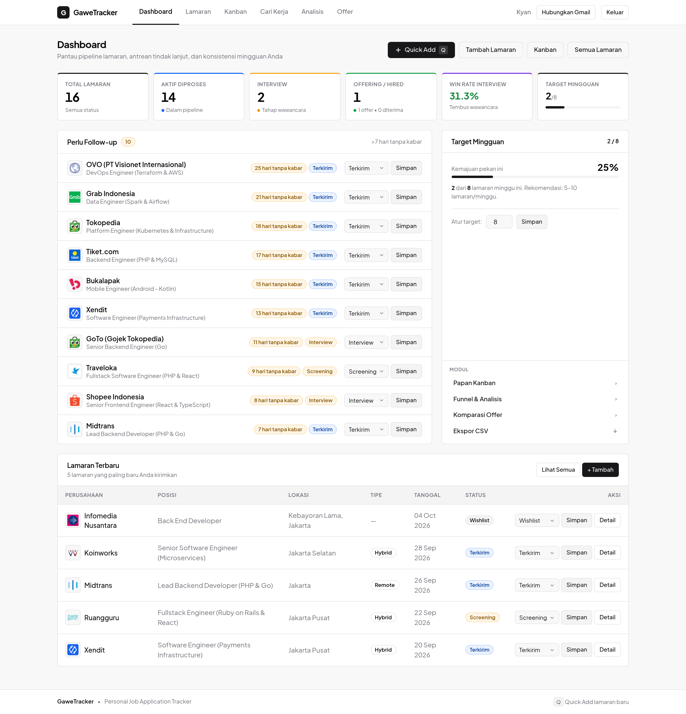
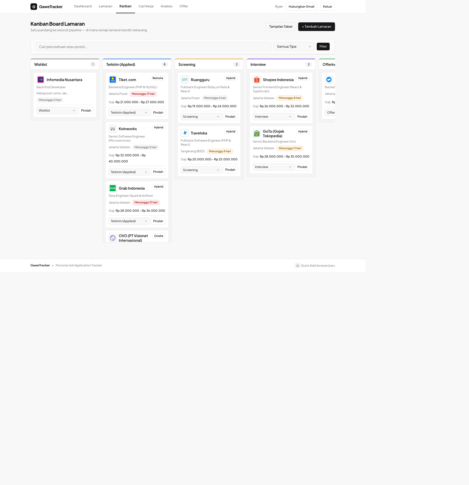
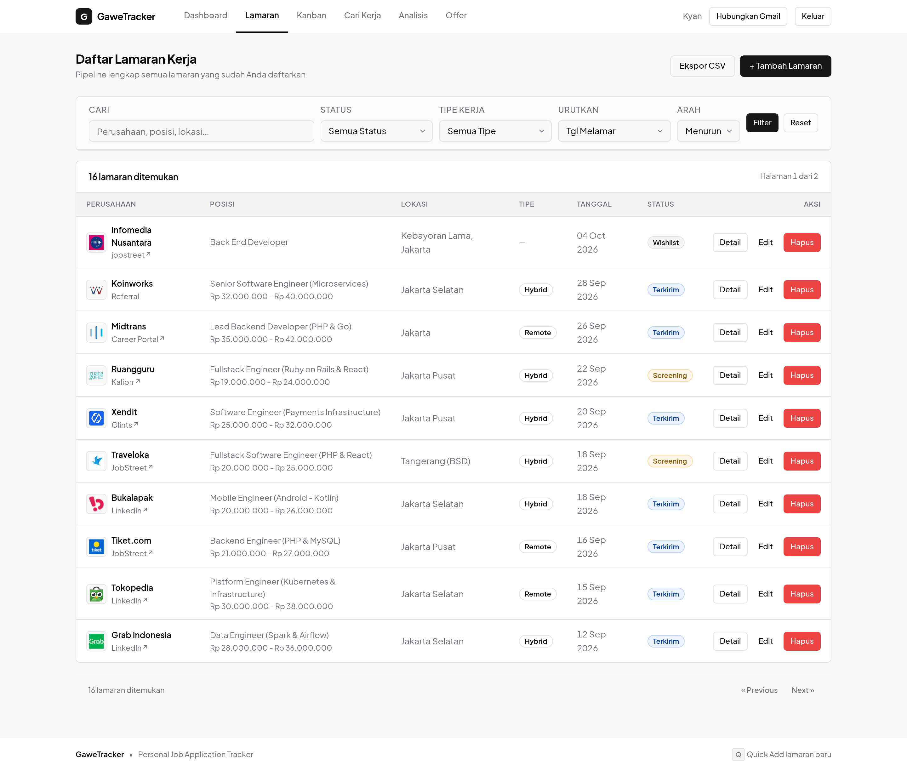
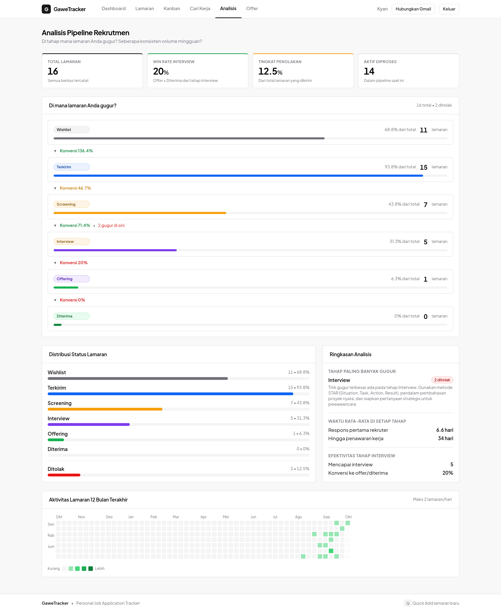
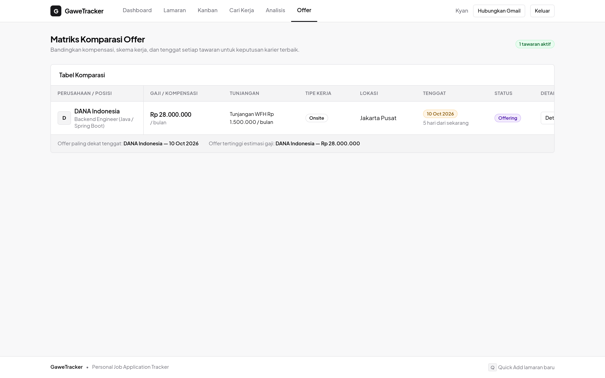

# GaweTracker

A personal job application tracker to log applications, monitor recruitment pipeline, and analyze patterns.

## Screenshots

| Dashboard | Kanban Board |
|---|---|
|  |  |

| Applications | Analytics |
|---|---|
|  |  |

| Offer Comparison |
|---|
|  |

Captured from a local instance seeded with realistic Indonesian tech-company data.

## Why This Exists

Kyan started applying for jobs and realized applications were scattered across emails, spreadsheets, and memory. GaweTracker was built to solve that problem: a single place to track every application, see where each one stands in the pipeline, and learn from the data over time.

## Features

- **CRUD for job applications** — company, position, location, work type, source, link, salary range, HR contact, notes
- **Pipeline stages** — wishlist → applied → screening → interview → offer → hired (plus rejected)
- **Kanban board** — visual cards grouped by stage
- **Dashboard** — total applications, follow-up reminders (>7 days without updates), weekly target progress, offer deadline alerts
- **Status timeline** — history of stage changes per application
- **Pipeline analytics** — conversion funnel, rejection breakdown by stage, time-to-response averages, weekly volume, 12-month activity heatmap
- **Offer comparison matrix** — side-by-side view of multiple offers with salary, benefits, and deadline
- **Interview prep checklist** — per-application checklist
- **Filter and search** — by company, position, status, work type; state persisted in URL
- **Company logos** — auto-resolved via Google Favicon API with initial-letter fallback
- **CSV export** — export filtered application data

## Tech Stack

| Layer | Choice | Why |
|-------|--------|-----|
| Framework | Laravel 13 | Full-featured PHP framework, active ecosystem |
| Frontend | Blade templates | Server-rendered HTML, no build step complexity |
| CSS | Pure CSS (public/css/shadcn.css) | No Vite/Node toolchain — reduces setup for solo project |
| Database | MySQL | Standard relational DB, works with Laravel migrations |
| Auth | Single-user login | v1 scope is personal use only, no public registration |
| Testing | PHPUnit | Laravel's default test framework |

## Local Setup

1. Clone the repository
   ```bash
   git clone https://github.com/kianlabs/gawetracker.git
   cd gawetracker
   ```

2. Copy environment file
   ```bash
   cp .env.example .env
   ```

3. Configure database in `.env`
   ```
   DB_CONNECTION=mysql
   DB_HOST=127.0.0.1
   DB_PORT=3306
   DB_DATABASE=gawetracker
   DB_USERNAME=your_username
   DB_PASSWORD=your_password
   ```

4. Install dependencies
   ```bash
   composer install
   ```

5. Generate application key
   ```bash
   php artisan key:generate
   ```

6. Run migrations with seed data
   ```bash
   php artisan migrate --seed
   ```

7. Start development server
   ```bash
   php artisan serve
   ```

8. Open http://localhost:8000 in your browser

Default login credentials (from UserSeeder):
- Email: kyan@gawetracker.test
- Password: password


## Deployment

GaweTracker is Laravel + MySQL. Deployment paths provided:

- **Cloudflare Tunnel** (this deployment) — container runs locally, exposed via
  `cloudflared` at **https://gawetracker.kianlabs.my.id**, protected by
  **Cloudflare Access** (email allow-list, owner only).
- **Fly.io** (container) — `fly.toml` + `Dockerfile` + `deploy/fly/README.md`
- **Oracle Cloud Always Free / plain Ubuntu VPS** — `deploy/oracle/` (provision,
  release, keepalive, backup scripts + crontab)

**Live**: https://gawetracker.kianlabs.my.id (gated by Cloudflare Access)

For Railway, Fly.io, or a custom VPS, see [DEPLOYMENT.md](DEPLOYMENT.md).

### Default Credentials
- Email: `kyan@gawetracker.test`
- Password: `password`

⚠️ **Change default password immediately after first login in production.**
## Email ingestion (JobStreet & Glints)

GaweTracker can read your JobStreet/Glints application emails and keep your
pipeline in sync automatically — confirmations create applications, and later
emails (interview, offer, rejection) update their status.

Parse and inspect a folder of `.eml` files without touching the database:

```bash
php artisan emails:import storage/app/emails --dry-run
```

Ingest them for real:

```bash
php artisan emails:import storage/app/emails
```

Pull directly from Gmail (read-only) — see the OAuth setup below:

```bash
php artisan emails:import --gmail --max=100
```

### Connect Gmail (OAuth)

The Gmail connection is a standard OAuth2 authorization-code flow with
`access_type=offline`, so a **refresh token** is stored and the 1-hour access
token is renewed automatically — no re-consent needed.

1. In the [Google Cloud Console](https://console.cloud.google.com/), create a
   project and enable the **Gmail API**.
2. Configure the OAuth consent screen (External, add yourself as a test user).
3. Create an **OAuth client ID** (type: Web application) and add the redirect
   URI: `{APP_URL}/gmail/callback`.
4. Put the credentials in `.env`:

   ```dotenv
   GOOGLE_CLIENT_ID=...apps.googleusercontent.com
   GOOGLE_CLIENT_SECRET=...
   GOOGLE_REDIRECT_URI="${APP_URL}/gmail/callback"
   ```

5. Log in to GaweTracker and click **Hubungkan Gmail** in the header, then grant
   read-only access. The button switches to **Gmail terhubung** once linked
   (click it to disconnect).

Tokens are **encrypted at rest** (see `User::$casts`); the refresh token is never
stored in plaintext.

Design notes:
- **Idempotent** — every email's `Message-ID` is recorded in `ingested_emails`,
  so re-running never double-counts.
- **Forward-only** — a status is only applied when it moves an application
  *forward*; a stale email can't downgrade an advanced one, and terminal
  (`hired`/`rejected`) states are never overwritten.
- **Digests ignored** — job-alert emails ("new jobs for you") never create
  applications.


## Tests

183 tests, 936 assertions — run the full suite:

```bash
php artisan test
```

Run specific test suites:

```bash
php artisan test --testsuite=Feature
php artisan test --testsuite=Unit
```

## Project Structure

```
app/
├── Http/Controllers/     # Request handlers (AuthController, JobApplicationController, AnalyticsController, etc.)
├── Models/               # Eloquent models (JobApplication, StatusHistory, OfferDetail, InterviewChecklist)

resources/
├── views/                # Blade templates (dashboard, kanban, analytics, offers, forms)

public/
├── css/shadcn.css        # Pure CSS styling (no build step)

tests/
├── Feature/              # Full-stack integration tests
├── Unit/                 # Isolated unit tests

database/
├── migrations/           # Schema definitions
├── seeders/              # Realistic Indonesian tech company seed data
```

## License

MIT
